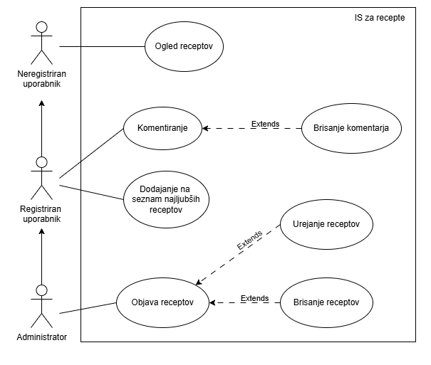
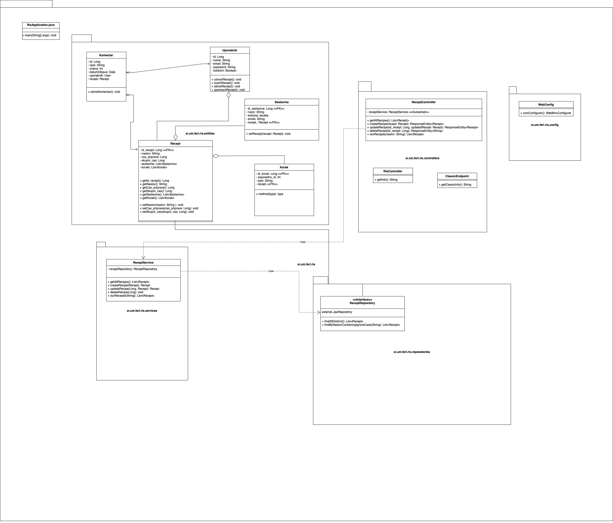

<!-- (maybe useful, jaz se nisem spomnila, sem morala guglat) :)
    # so naslovi (#=h1, ##=h2 ...) 
    **nekaj** je boldano
    *nekaj* je italic
    ***nekaj*** je bold&italic
-->

# FlavourfulFinds
**Ime skupine:** tbd  
**Članice skupine:** Sanja Muršič, Tara Sedovšek, Kaja Vidmar

## Dokumentacija za razvijalce
1. ***Opis projektne strukture***
    1. **Backend** 
        Backend vsebuje:
        - config: Konfiguracije in nastavitve aplikacije.
        - controllers: API kontrolerji, ki obravnavajo različne zahteve (npr. ReceptController).
        - entities: Modeli podatkovne baze, ki definirajo strukturo podatkov.
        - repositories: Dostop do podatkovne baze z uporabo JPA.
        - services: Povezovanje kontrolerjev in podatkovne modele.
        - RisApplocations.java: Razred, ki omogoča zagon Spring Boot aplikacije.

    2. **Frontend** 
        Frontend vsebuje:
        - javascript: app.js - pošiljanje zahtev na backend in jasc.js - za funkcionalnost spletne strani.
        - HTML datoteke: Vse strani uporabniškega vmesnika (npr. `index.html`, `login.html`).
        - stilska_predloga.css: CSS datoteka za oblikovanje.
2. ***Standardi kodiranja***
    1. **Struktura projekta**: 
    Projekt je razdeljen na backend in frontend, kjer vsak del ločen v poimenovane mape, kot so controllers, entities, services in repositories za backend in javascript, slike in html datoteke za frontend.

    2. **Slog**: 
    V backendu uporabljamo PascalCase za poimenovanje razredov - vsaka prva črka besede je z veliko začetnico (npr. `ReceptController.java`).

## Navodila za nameščanje in zagon aplikacije
1. ***Predpogoji***
    Za nameščanje je nujno potrebno, da imaš na računalniku nameščeno naslednje:
    1. **Java Development Kit (JDK)** - Verzija 11 ali višja
        - namestitev: https://www.oracle.com/java/technologies/downloads/?er=221886
        - preveri namestitev v terminalu: `java -version`

    2. **Node.js in npm** - Node.js verzija 14 ali višja, npm verzija 6 ali višja
        - namestitev: https://nodejs.org/en
        - preveri namestitev v terminalu: `node -v` in `npm -v`
    3. **Git** - da lahko iz GitHuba kloniraš repozitorij
        - namestitev: https://git-scm.com/downloads
        - preveri namestitev z ukazom: `git --version`

2. ***Kloniraj repozitorij (Clone Repository)***
    Z ukazi:
    - `git clone https://github.com/woooooah/ris_projekt.git`
    - `cd ris_projekt`

3. ***Kreiranje podatkovne baze***
    - V ris_projekt/backend/src/main/resources izberi datoteko baza_recepti.sql.
    - Odpri jo v svojem IDE in stisni na run button, ki bo ustvaril podatkovno bazo. 

4. ***Pogon zaledja (backenda)***
    Z naslednjimi ukazi poženi backend.
    - `cd ris_projekt`
    - `cd backend`
    - `./mvnw clean install` - to naredimo le pvič, da zgradimo projekt
    - `./mvnw spring-boot:run` - s tem ukazom poženemo backend server, sedaj teče na: http://localhost:8080

5. ***Napolni bazo*** 
    - ris_projekt/backend/src/main/resources izberi datoteko data.sql.
    - napolni bazo

6. ***Pogon pročelja (frontenda)***
    Za delovanje aplikacije ni dovolj, da zaženemo le backend, ko teče backend server, potrebujemo zagnati tudi frontend server, na katerem se lahko potem prikazujejo tudi podatki iz backenda (kompletna aplikacija)
    - `cd ris_projekt`
    - `cd frontend`
    - `npm install` - inštalira node_modules, ki so potrebni za zagon bakcenda
    - `node server.js` - s tem ukazom zaženemo frontend server, ki sedaj teče na: http://localhost:3000

7. ***Dostop do aplikacije***
    Ko oba serverja (frontend in backend) tečeta, lahko dostopamo do aplikacije na: http://localhost:3000

## Navodila za razvijalce – prispevanje k projektu

 1. ***Orodja in ogrodja***
    Backend:
    •	Framework: Spring Boot
    •	Java:  verzija "1.8.0_401"
    •	Build orodje: Maven

    Frontend:
    •	Jeziki: JavaScript, HTML, CSS
    •	Priporočena knjižnica: ni obvezne knjižnice, ampak priporočamo uporabo jQuery za enostavnejšo manipulacijo DOM, če je to potrebno.

    Splošna orodja:
    •	IDE: Priporočena sta IntelliJ IDEA ali Eclipse za backend (Spring Boot) in Visual Studio Code za frontend.
    •	GitHub: Za upravljanje verzij in prispevanje uporabite GitHub, kjer je gostovan repozitorij.

2. ***Okolje***
    Java in Maven:
    •	Prepričajte se, da imate nameščen Java 11 (ali novejšo različico). Preverite z ukazom: `java -version`
    •	Prepričajte se, da imate nameščen Maven za gradnjo projekta: `mvn -version`
    Spring Boot aplikacija:
    •	V projektu najdite glavno aplikacijsko datoteko (RisApplication.java) in jo zaženite v vašem IDE ali uporabite ukaz za zagon v terminalu: `mvn spring-boot:run`

    Frontend:
    •	Sprednji del spletne strani je zgrajen z HTML, CSS in JavaScript in ne zahteva posebne namestitve ali predprocesorja. Vse datoteke so v mapi ris_projekt/frontend.

3. ***Prispevanje***
    •	Sledite dogovorjenemu stilu pisanja kode (uporabite privzeti stil za Java v Spring Boot in osnovna priporočila za HTML, CSS in JavaScript).
    •	Pišite jasna in jedrnata commit sporočila v katerih natančno opišete katere spremembe ste naredili.
    •	GitHub repozitorij vsebuje osnovno README datoteko s povzetkom projekta, navodili za namestitev in uporabo. Dokumentacija naj bo redno posodobljena glede na spremembe v aplikaciji.

## Vizija projekta
Naša vizija je ustvariti intuitivno platformo za ljubitelje kuhanja, ki omogoča enostavno filtriranje receptov po času priprave in stopnji zahtevnosti ter hitro iskanje na enem mestu. Poudarek je na prikazu hranilne vrednosti vsakega recepta, vključno s kalorijami, beljakovinami, ogljikovimi hidrati, maščobami in drugimi hranili, kar bo v pomoč uporabnikom z različnimi prehranskimi cilji ali zdravstvenimi potrebami. Aplikacija spodbuja sodelovanje in izmenjavo izkušenj, saj uporabnikom omogoča ocenjevanje receptov, dodajanje komentarjev in deljenje nasvetov za izboljšave. Registriranim uporabnikom ponujamo funkcionalnosti, kot so shranjevanje ali všečkanje receptov ter možnost kopiranja receptov v PDF obliki. Poleg tega aplikacija omogoča prilagoditev količine sestavin glede na število oseb, kar poenostavi načrtovanje obrokov in zagotavlja natančne izračune za vsakogar.

## Besednjak
- **FlavourfulFinds** - *Portal z recepti*
- **Recept** - *navodilo s podatki o vrsti, količini živil in postopku za pripravo določene jedi, pijače*
- **Naslov recepta** - *Poimenovanje, ki ga damo receptu*
- **Čas priprave** - *Čas, ki ga potrebujemo za pripravo nekega recepta*
- **Skupen čas priprave** - *Skupen čas, potreben za pripravo nekega recepta (vključno s časom za peko/kuhanje/hlajenje ...)*
- **Sestavina** - *Snov, ki skupaj z drugimi snovmi sestavlja, tvori kako snov*
- **Količina** - *Kar opredeljuje kaj glede na število merskih enot ali enot sploh*
- **Enota** - *Dogovorjena količina za merjenje količin iste vrste*
- **Korak** - *Eno navodilo za specifičen del recepta*
- **Navodilo** - *Kar pojasnjuje, določa, kako se kaj dela, s čim ravna*
- **Minuta** - *Enota za merjenje časa, 1 minuta = 60 sekundam*

## DPU 

## Razredni diagram

1. ***RisApplication.java***
    **Namen:**
    Razred `RisApplication.java` je začetna točka aplikacije, kjer se izvede inicializacija celotne aplikacije. Namen razreda je omogočiti zagon aplikacije z uporabo metode main, ki sproži Spring Boot framework in ustvari kontekst aplikacije.

    **Metoda:**
    Metoda `main(String[] args): void`, ki se izvede ob zagonu aplikacije.

2. ***Komentar***
    **Namen:**
    Namen: Predstavlja povratne informacije uporabnikov za posamezne recepte. Komentarji vključujejo oceno in opis, ki pomagajo drugim uporabnikom razumeti kakovost in uporabnost recepta.

    **Metoda:**
    Metoda `izbrisiKomentar()` omogoča odstranitev komentarja iz sistema, npr. če ga želi uporabnik ali administrator izbrisati.

3. ***Uporabnik***
    **Namen:**
    Predstavlja uporabnike aplikacije, ki lahko ustvarjajo, urejajo in ocenjujejo recepte. Razred omogoča identifikacijo uporabnikov s pomočjo unikatnega ID-ja, imena, e-pošte in gesla. Atribut isAdmin določa, ali ima uporabnik administratorske pravice, kar omogoča različno raven dostopa.

    **Metode:**
    Metoda `ustvariRecept()` omogoča uporabniku ustvari nov recept, `oceniRecept()` omogoča dodajanje oceno obstoječemu receptu, `izbrisiRecept()` odstrani recept iz sistema in `spremeniRecept()` posodobi podrobnosti o receptu.

4. ***Recept***
    **Namen:**
    Recept je osrednji razred sistema, ki vsebuje vse ključne informacije, potrebne za pripravo jedi, kot so naslov, čas priprave, sestavine in koraki priprave. Vsak recept je povezan z natančno opisanimi sestavinami in koraki, kar omogoča jasen in podroben opis postopka priprave.

    **Metode:**
     Getterji(`getId_recept()`) in setterji(`setNaslov(naslov: String)`) omogočajo enostavno branje in urejanje atributov recepta, medtem ko povezave s sestavinami in koraki olajšajo dostop do povezanih podatkov.

5. ***Sestavine***
    **Namen:**
    Predstavlja posamezne sestavine, potrebne za pripravo recepta. Povezana je s konkretnim receptom, kar omogoča modularnost in ponovno uporabo sestavin v več receptih.

    **Metoda:**
    Metoda `setRecept(recept: Recept)` omogoča povezovanje sestavine z določenim receptom.

6. ***Korak***
    **Namen:**
    Predstavlja en korak v postopku priprave recepta. Vsak korak ima zaporedno številko in opis, ki jasno opiše, kaj mora uporabnik narediti v tem delu postopka. Povezan je s specifičnim receptom, kar omogoča ločevanje korakov za različne recepte.

    **Metoda:**
    Metoda `method(type)` omogoča uporabo razširjenih funkcij za delo s koraki.

7. ***ReceptService***
    **Namen:**
    Namen upravljanje logike poslovnih procesov za delo z recepti. Glavna naloga je izvajanje operacij, kot so pridobivanje vseh receptov, ustvarjanje, posodabljanje in brisanje receptov.

    **Metode:**
    Metoda `getAllRecipes()` pridobi seznam vseh receptov, `createRecipe(Recept recept)` doda nov recept v sistem, `updateRecipe(Long id, Recept updatedRecipe)` posodobi podrobnosti obstoječega recepta, `deleteRecipe(Long id)` izbriše recept glede na ID, `isciRecepte(String naslov)` poišče recepte na podlagi naslova.

8. ***ReceptRepository***
    **Namen:**
    Z uporabo JPA omogoča izvajanje CRUD operacij nad tabelo receptov in razširja funkcionalnosti JPA z dodatnimi metodami za iskanje receptov.

    **Metode:**
    Metoda `findAllDistinct()` vrne seznam vseh unikatnih receptov in metoda `findByNaslovContainingIgnoreCase(String naslov)` poišče recepte, katerih naslov vsebuje določeno besedilo.

9. ***ReceptContoller**
    **Namen:** 
    Zagotavlja API-endpointe za interakcijo s podatki o receptih. Deluje kot most med odjemalci (frontend) in logiko poslovanja (ReceptService). Zagotavlja dostop do funkcionalnosti, kot  so iskanje receptov, ustvarjanje, posodabljanje in brisanje receptov.

    **Metode:**
    Metoda `getAllRecipes()` API za pridobivanje vseh receptov, `createRecipe(Recept recept)` API za ustvarjanje novega recepta, `updateRecipe(Long id, Recept updatedRecipe)` API za posodobitev obstoječega recepta, `deleteRecipe(Long id)` API za brisanje recepta in `isciRecepte(String naslov)` API za iskanje receptov po naslovu.

10. ***RisController***
    **Namen:**
    RisController je splošen kontroler, ki skrbi za osnovne informacije o aplikaciji.

    **Metoda:**
    Metoda `getInfo(): String` vrne osnovne informacije o aplikaciji, kot so verzija, stanje ali preprosto sporočilo, ki kaže, da aplikacija deluje.

11. ***ClassicEndpoint***
    **Namen:**
    ClassicEndpoint je preprost kontroler, ki omogoča dostop do klasičnih informacij ali funkcionalnosti aplikacije.

    **Metoda:**
    Metoda `getClassicInfo(): String` vrne določene informacije o aplikaciji.

12. ***WebConfig***
    **Namen:**
    WebConfig je konfiguracijski razred za spletno aplikacijo. Njegova glavna naloga je konfiguriranje pravil za komunikacijo med strežnikom in odjemalci.

    **Metoda:**
    Metoda `corsConfigurer(): WebMvcConfigurer` nastavi pravila CORS, da omogoči izmenjavo podatkov med različnimi domenami. Ta metoda omogoča povezovanje aplikacijskih API-jev z različnimi frontend odjemalci, ki tečejo na drugih domenah.
